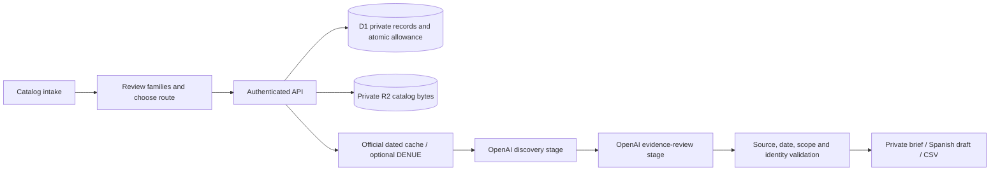

# Architecture

## Boundaries

The public React workspace performs deterministic, editable catalog routing and displays manually audited examples. Account-scoped API routes enforce ownership server-side. Uploaded catalogs and generated research are never public examples automatically.

## Data model

`TenderOpportunity`, `PhysicianLead`, and `InstitutionLead` form a discriminated union. Evidence carries publication and retrieval times independently. Dataset metadata carries dataset and import dates independently. Each run stores the selected route, territory, reviewed families, supplier-readiness answers, limitations, stages, provider response identifier and estimated cost. Unknown information stays null/unverified.

D1 tables: catalogs, runs, daily_claims, budgets, datasets, cached_records, provider_records. SQL is parameterized. Migrations are generated from the Drizzle schema; application startup does not create tables.

## Authentication and private state

The Sites gateway supplies trusted authenticated-user headers. Every private query includes the authenticated owner. Mutation requests require the workspace origin. Streamed request bodies have byte limits in addition to declared-size checks. R2 objects use an owner/run identifier and have no public URL endpoint. Private API responses use `Cache-Control: private, no-store`.

Deletion stops active work, requests provider cleanup for a retained response, deletes associated application rows and removes uploaded bytes. Aggregate usage and daily claims remain so deleting a run cannot replenish the allowance. Provider retention policies are separate from local deletion. A provider cleanup failure blocks deletion and leaves a retryable state rather than silently declaring success.

## Research execution

The browser advances a persisted run while the page is open. OpenAI background response IDs survive reloads. Reopening a saved run resumes polling; closing the tab can leave the run awaiting the next advance. This is intentionally not a continuous monitoring system.

A conditional D1 lease prevents concurrent advances. Starting-request markers prevent automatic duplicate provider launches after an ambiguous network failure. Each run allows two stages, six tool calls per stage, 6,000 output tokens per stage, at most 160 polls, and a 30-minute polling deadline. The strict-output schema replaces unsupported URI-format annotations with an HTTPS pattern; runtime validation still checks URLs. Source/JSON failures publish no unverified partial list. Cancellation attempts to stop the provider and settles measured or conservatively reserved spending.

Source URLs must come from actual tool source metadata. Procurement evidence must be official government material. Open tenders additionally require a future timezone-qualified deadline and checked amendments. Duplicate entities are removed. Unsupported contact fields are cleared, credentials stay unverified, and scope filters exclude unrelated screen-monitor purchases and maintenance/rental mismatches. Source comparison removes tracking parameters while preserving identifying query parameters. Direct leads use conservative city/state text matching (including CDMX aliases), not geocoding; one city or state per run is recommended. A Spanish introduction fallback replaces outreach that is not a usable Spanish draft. These checks supplement model review; they are not a proof that every claim is true.

## Source connectors

- On-demand OpenAI web research uses primary sources and treats catalog/documents as untrusted data. Private prices and other catalog details must not be included in public search queries.
- Optional DENUE HTTP lookup runs server-side and uses a token stored as a secret. The initial result window is limited to 40 establishments and does not imply complete city coverage.
- Owner CSV imports accept official government/INEGI URLs, dated metadata, up to 2 MB and 1,000 records. Imports become discoverable only after all rows are written. Cache results are discovery context, not current tender verification.
- Doctoralia content, ratings, reviews and appointment availability are excluded. CONACEM/SEP links support separate manual credential checks.

## Allowance

One D1 transaction checks remaining pool capacity, checks the owner's active run/daily claim, inserts the run, reserves $2, and writes the visitor daily claim. Settlement atomically replaces the reservation with estimated usage once. Ambiguous provider outcomes retain a conservative reservation charge. Owner allocation is not available to visitors. `OWNER_INITIAL_SPEND_MICROS` carries already-incurred local testing costs into a new hosted owner ledger exactly once; changing it does not overwrite an existing ledger. Known rejected provider request creation releases the uncharged reservation while retaining prior stage usage.

This ledger estimates API charges from usage and web-search calls. It is not a provider billing limit. Production should retain separate project-level billing controls. No secret is sent to the browser or committed to the source repository.

## Agent-accessible UI

Three WebMCP tools read the visible workspace, open an example, or stage catalog/route input. None starts paid research or sends outreach. The same validation and visible form controls remain available to the user.
